# Technical System Architecture: Python, Django, FastAPI & uv (Final Layout Optimization)

This version maintains the exact 5-Agent logic and tech stack. To fix the Mermaid.js rendering engine's habit of throwing "open-ended" routing lines outside the main bounding box, the overarching "Project Env" wrapper has been removed. 

Instead, the architecture is cleanly divided into **5 stacked horizontal layers**. This forces the graph engine to route the arrows cleanly between the layers without crossing structural borders.

```mermaid
graph TD
    %% Define styles
    classDef default fill:#003366,stroke:#00ccff,stroke-width:1px,color:#fff;
    classDef database fill:#004d4d,stroke:#00ffcc,stroke-width:2px,color:#fff;
    classDef worker fill:#333333,stroke:#cc99ff,stroke-width:2px,color:#fff;
    classDef ui fill:#005500,stroke:#66ff66,stroke-width:2px,color:#fff;
    classDef external fill:#222222,stroke:#888888,stroke-width:1px,color:#fff;
    classDef aiAgent fill:#4b0082,stroke:#cc99ff,stroke-width:2px,color:#fff;
    classDef gatekeeper fill:#800000,stroke:#ff3333,stroke-width:3px,color:#fff;
    classDef orchestrator fill:#004080,stroke:#00ccff,stroke-width:2px,color:#fff;

    %% ----------------------------------------------------
    %% TIER 1: INBOUND EXTERNAL SOURCES
    %% ----------------------------------------------------
    subgraph Tier1 ["<b>1. Inbound External Sources</b>"]
        WebTraffic["Web Forms / Chatbots"]:::external
        Email_In["Email Server<br/>(Forwarded Replies)"]:::external
    end

    %% ----------------------------------------------------
    %% TIER 2: FASTAPI INGESTION LAYER
    %% ----------------------------------------------------
    subgraph Tier2 ["<b>2. FastAPI Async Ingestion Layer (Managed by 'uv')</b>"]
        InboundAPI["Inbound Webhook Receiver"]:::default
        ReplyAPI["Client Reply Webhook Receiver"]:::default
    end

    %% ----------------------------------------------------
    %% TIER 3: CELERY DATA VALIDATION & ENRICHMENT
    %% ----------------------------------------------------
    subgraph Tier3 ["<b>3. Data Pre-Processing Workers (Celery & Redis)</b>"]
        Task_Check["Validation Worker<br/>(Check CRM & App DB)"]:::worker
        Task_Enrich["Enrichment Worker<br/>(Lusha & LinkedIn API)"]:::worker
    end

    %% ----------------------------------------------------
    %% TIER 4: NATIVE PYTHON AI AGENTIC CORE
    %% ----------------------------------------------------
    subgraph Tier4 ["<b>4. AI Agentic Core (Native OpenAI SDK Orchestrator)</b>"]
        PyOrchestrator["<b>Python Orchestrator</b><br/>(State Machine & Task Coordinator)"]:::orchestrator
        
        Agent1["<b>Agent 1:</b> Triage Analyst<br/>(Intent & Sentiment JSON)"]:::aiAgent
        Agent2["<b>Agent 2:</b> Strategist<br/>(Next Best Action Routing)"]:::aiAgent
        Agent3["<b>Agent 3:</b> Copywriter<br/>(Email & Message Drafting)"]:::aiAgent
        Agent4["<b>Agent 4:</b> Scheduler<br/>(Calendar & Slot Negotiation)"]:::aiAgent
        
        Agent5["<b>Agent 5: Consolidated Gatekeeper</b><br/>(Validates Format & Logic of Agents 1-4 for 100% Accuracy)"]:::gatekeeper
    end

    %% ----------------------------------------------------
    %% TIER 5: EXECUTION WORKERS & CADENCE TIMERS
    %% ----------------------------------------------------
    subgraph Tier5 ["<b>5. Action Execution & Cadence (Celery Background Tasks)</b>"]
        Task_Action["Action Execution Worker<br/>(Email Dispatch, Zoho Sync, Calendar Booking)"]:::worker
        CadenceTimer["Cadence Delay & Timeout Queue<br/>(Scheduled Follow-up Checks)"]:::worker
    end

    %% ----------------------------------------------------
    %% TIER 6: DJANGO APP, DATABASE & LOGGING LAYER
    %% ----------------------------------------------------
    subgraph Tier6 ["<b>6. Django Administration, Database & Logging Layer</b>"]
        UI_Dash["<b>Management UI & Dashboard</b><br/>(Configures Rules, Cadences & Visualizes Metrics)"]:::ui
        GlobalLogger["<b>Global Activity Logger</b><br/>(Captures 100% of Micro-Actions & States)"]:::default
        ORM["Django ORM<br/>(Unified Data Access Layer)"]:::default
        
        PG_DB[("<b>PostgreSQL</b><br/>Leads, Logs, Rules, State History")]:::database
        Vector_DB[("<b>Vector Database</b><br/>Knowledge Base / RAG Store")]:::database
        Redis[("<b>Redis</b><br/>Task Queue Broker & State Cache")]:::database
    end

    %% ----------------------------------------------------
    %% TIER 7: EXTERNAL APIS & OUTBOUND SERVICES
    %% ----------------------------------------------------
    subgraph Tier7 ["<b>7. External APIs & Outbound Services</b>"]
        CRM["Zoho CRM API"]:::external
        EnrichAPI["Lusha / LinkedIn APIs"]:::external
        Email_Out["Outbound Email Service<br/>(SendGrid / SMTP)"]:::external
        Calendar["Calendar Services<br/>(Google / Outlook Calendar API)"]:::external
    end

    %% ----------------------------------------------------
    %% PROCESS & DATA FLOW CONNECTIONS
    %% ----------------------------------------------------

    %% Step 1: Ingestion
    WebTraffic -->|Inbound JSON| InboundAPI
    Email_In -->|Forward Reply| ReplyAPI

    %% Step 2: Handoff to Pre-Processing & Direct Triggers
    InboundAPI -->|Dispatch Validation| Task_Check
    ReplyAPI -->|Interrupt & Process Reply| PyOrchestrator

    %% Step 3: Validation & Enrichment Routing
    Task_Check -->|Data Insufficient| Task_Enrich
    Task_Check -->|Data Sufficient| PyOrchestrator
    Task_Enrich -->|Pass Enriched Lead| PyOrchestrator

    %% Step 4: Multi-Agent Orchestration & Gatekeeper Loops
    PyOrchestrator --> Agent1
    Agent1 --> Agent5
    Agent5 -- "FAIL (Redo)" --> Agent1
    Agent5 -- "PASS" --> PyOrchestrator

    PyOrchestrator --> Agent2
    Agent2 --> Agent5
    Agent5 -- "FAIL (Redo)" --> Agent2
    Agent5 -- "PASS" --> PyOrchestrator

    PyOrchestrator --> Agent3
    Agent3 --> Agent5
    Agent5 -- "FAIL (Redo)" --> Agent3
    Agent5 -- "PASS" --> PyOrchestrator

    PyOrchestrator --> Agent4
    Agent4 --> Agent5
    Agent5 -- "FAIL (Redo)" --> Agent4
    Agent5 -- "PASS" --> PyOrchestrator

    %% Step 5: Execution Handoff
    PyOrchestrator -->|Approved Action & Payload| Task_Action

    %% Step 6: Cadence Follow-up Loop
    Task_Action -->|Trigger Cadence Wait| CadenceTimer
    CadenceTimer -->|Timeout - Trigger Follow-up| PyOrchestrator

    %% Step 7: Database & Knowledge Base Access
    Task_Check <-->|Query Lead History| ORM
    PyOrchestrator <-->|Retrieve Context & Rules| ORM
    PyOrchestrator <-->|RAG Knowledge Retrieval| Vector_DB
    GlobalLogger --> ORM
    UI_Dash <-->|Read / Write Rules & Logs| ORM
    ORM <--> PG_DB

    %% Step 8: External API Sync & Dispatch
    Task_Check <-->|Check / Pull Lead| CRM
    Task_Enrich <-->|Enrich Contact Details| EnrichAPI
    Task_Action <-->|Create / Update Records| CRM
    Task_Action -->|Send Outreach Email| Email_Out
    Task_Action <-->|Check Availability & Book| Calendar

    %% Step 9: Global Activity Logging (Telemetry)
    InboundAPI -.-> GlobalLogger
    ReplyAPI -.-> GlobalLogger
    Task_Enrich -.-> GlobalLogger
    Agent5 -.-> GlobalLogger
    PyOrchestrator -.-> GlobalLogger
    Task_Action -.-> GlobalLogger

```

